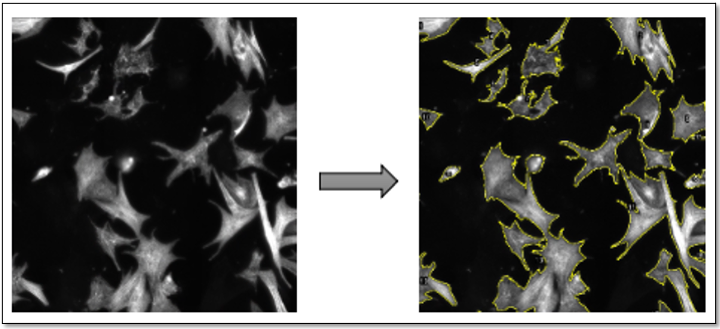

# Cell's geometry profiling for neonatal rat cardiomyocytes in 2D culture

#### Intracellular redox homeostasis modulates the morphology of cardiomyocytes

Redox homeostasis is affected in heart failure. Remodelling of heart failure has been associated with enhanced ROS production due to alterations in the excitation-contraction coupling, or due to altered cytoplasmic calcium handling (Münzel, Gori et al. 2015). However, these alterations are met by adaptations of the antioxidative system to restore redox homeostasis. We have noted that redox induces changes to cardiomyocytes geometry, where oxidative stress induces cardiomyocytes’ elongation and atrophy, while antioxidative compounds promotes cardiomyocytes hypertrophy. These alterations in the cardiomyocyte’s geometry resemble the changes observed to geometry of the heart during heart failure and indicate that intracellular redox homeostasis is involved in regulating the morphology of cardiomyocytes. We quantitatively measured these alterations in cell morphology upon treating neonatal rat cardiomyocytes with a pro-oxidant (Sulforaphane, SF) and an antioxidant (N-Acetyl Cysteine, NAC). We utilized florescence microscopy imaging, followed by image analysis with ImageJ.
This experiment is part of a study that investigates the impact of endogenous antioxidative defenses in the heart and the potentially adverse effects associated with excessive quenching of physiological levels of reactive oxygen species, which act as cellular signalling molecules. The study is now available as a pre-pint on BioRxiv (Epigenetic modulators link mitochondrial redox homeostasis to cardiac function, doi: https://doi.org/10.1101/2022.03.26.485908).

The pipeline provided in this project performs cell segmentation and quantification using Fiji and it was implemented in ImageJ Macro Language.

#### 1.	Input directory

The input directory should contain subfolders corresponding to the different experimental conditions. For the images of neonatal rat cardiomyocytes, there are three experimental groups: Control, NAC and SF

#### 2.	Software requirements

The software listed below should be installed before running the Fiji script. 

* [Fiji](https://fiji.sc): follow the instructions in the link to download Fiji.
* [Bioformats plugin](https://imagej.net/Bio-Formats). See section “Daily builds” in order to check if bioformats plugin is installed/updated.

#### 3.	Running the pipeline

To run the pipeline, open Fiji and go to Plugins – Macros – Edit... and browse the *cardiomyocytes_geometry_profiling.ijm* file to load the script. Two parameters can be modified in the pipeline: 

* thresholdMethod: selected threshold method. Default is set to Li’s Minimum Cross Entropy
* minCellArea: minimum area in pixels of a particle to be considered in the analysis

After adjusting the parameters, press the “Run” button and wait until all images are processed. During the execution of the pipeline, the “Run” button will be disabled.

#### 4.	Ouput files

* A summary file (*csv format*) saved in the input directory containing the total cell area for each processed file.
* Files containing the measurements of each segmented particle and for each processed file.
*	A folder named “output” containing the segmentation results for each processed file, as illustrated below.

Note: the nomenclature of the output folders and files contains a combination of the selected parameter values. 

